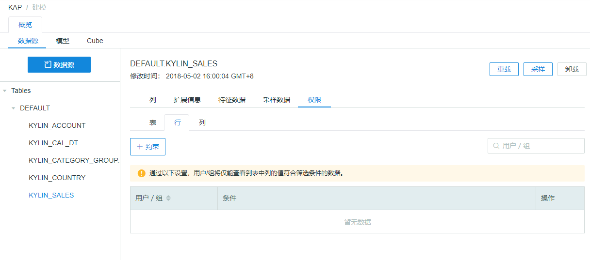
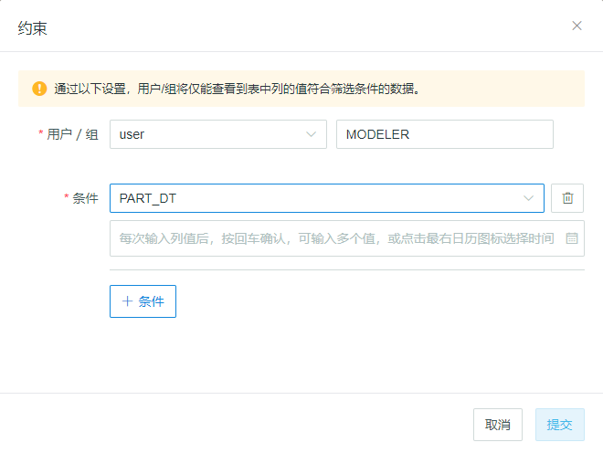
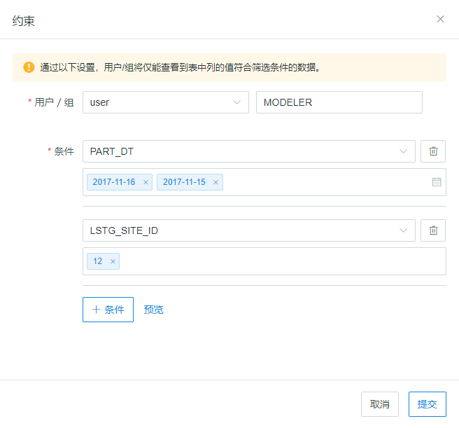
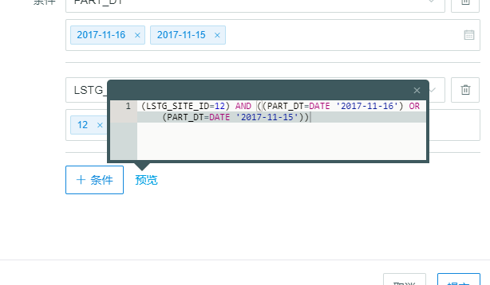
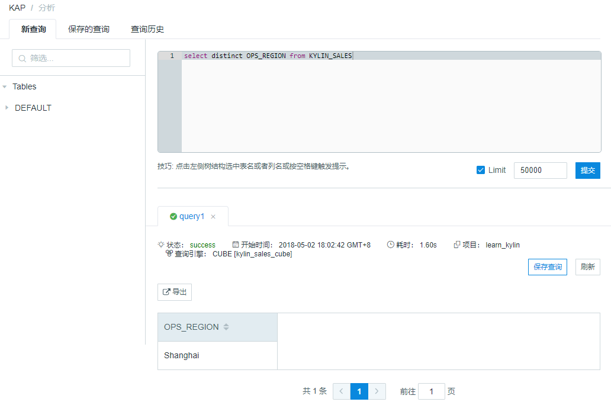
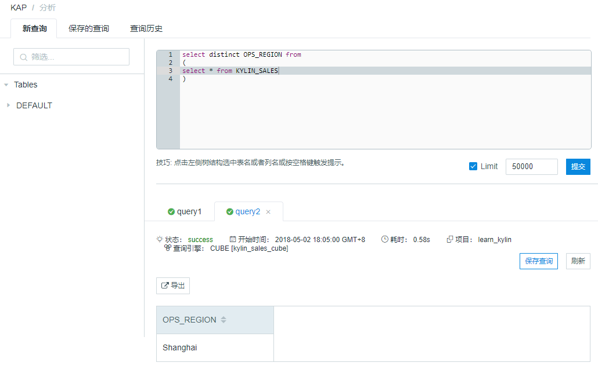

## 行级访问权限

**行级访问权限**过滤了用户／组在表上可访问的行。行级访问权限通常都被用于限制非常敏感的数据。比如在一家公司中，销售大区经理仅能查看到属于其大区的销售数据，但看不到其他大区的销售数据。如果要给东北大区的销售经理设置行级权限，那么他仅能看到地区=‘东北’的销售数据。

不论用户／组的查询使用 Cube、明细表索引还是查询下压查询都会受到行级权限的过滤。如果用户／组的查询中没有使用到行级权限受限的列，那么行级权限则不会作用到查询上。

当表初次被导入 Kyligence Enterprise 中或者项目从低版本升级到有行级权限功能的版本时，默认情况下所有用户／组在表上都**没有**设置行级权限。

行级权限需要以项目为单位进行设置。也就是说如果同一个表在不同项目中都导入了，两个项目下的行级权限需要分别设置。

在对某个用户赋予行级访问权限前，应先确保该用户已获得当前项目的访问权限。

> 注意：权限配置会受到 BI 前端缓存的影响。如果一个没有访问权限限制的用户在 BI 工具查看了某报表，BI 工具可能生成报表缓存，当另一个用户登陆查看同一张报表时，BI 工具可能会使用之前生成的缓存，而不再发送查询，导致用户因此绕开了其被限制的访问权限。

### 管理行级项目权限

#### 添加约束

按照以下步骤，添加行级访问权限约束：

1. 点击左侧导航栏中的`建模`。
2. 点击`数据源`，选择一个已导入的表。
3. 在这个表上，点击`权限`，然后选择`行`。
4. 点击`+约束`以约束行级权限。
5. 在弹窗中选择用户／组。
6. 选择列，并输入欲限定的值。点击回车确认每个输入的值。你可以输入多个值进行过滤。
7. (可选) 点击`+`号添加对另一个列的过滤。
8. 点击`保存`。

如果对同一个列过滤多个值，每个值之间的逻辑运算符为`或`。 当为同一个用户／组设置多列的过滤的值时，不同列之间的逻辑运算符为`与`。

在设置行级权限的弹窗中点击`预览`你可以预览行级权限将会生成的 Where 语句。

#### 修改约束

按照以下步骤对行级访问权限约束进行修改：

1. 点击左侧导航栏中的`建模`。
2. 点击`数据源`，选择一个已导入的表。
3. 在这个表上，点击`权限`，然后选择`行`。
4. 在`操作`中，点击`修改`按钮。
5. 在弹窗中，对行级权限进行修改。
6. 点击`保存`。

#### 删除约束

按照以下步骤对行级访问权限约束进行修改：

1. 点击左侧导航栏中的`建模`。
2. 点击`数据源`，选择一个已导入的表。
3. 在这个表上，点击`权限`，然后选择`行`。
4. 在`操作`中，点击`删除`按钮。

### 验证行级访问权限

在本例中，我们以用户为例来验证行级访问权限，组访问权限的验证方法与此类似。用户 `joanna`  是一个有项目 `learn_kylin` 访问权限的用户，并且被限制了对列 `OPS_REGION` 的访问仅为 ‘Shanghai’。

登录用户 `joanna` 来到查询页面使用列 `OPS_REGION` 进行查询以验证行级访问权限约束是否生效了。

如截图所示用户 `joanna` 仅能看到 `OPS_REGION` 值为 ‘Shanghai’ 的行。

