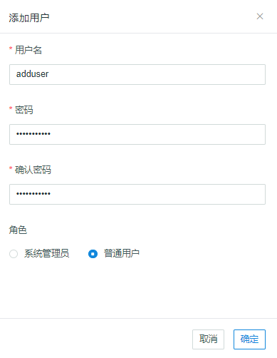
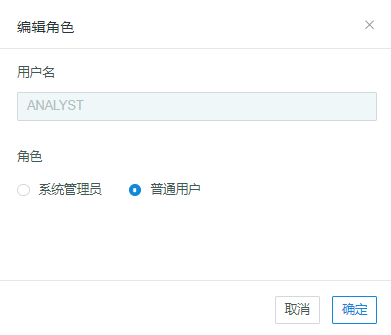
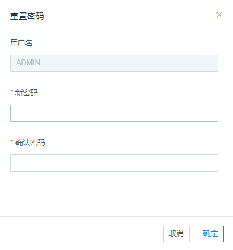
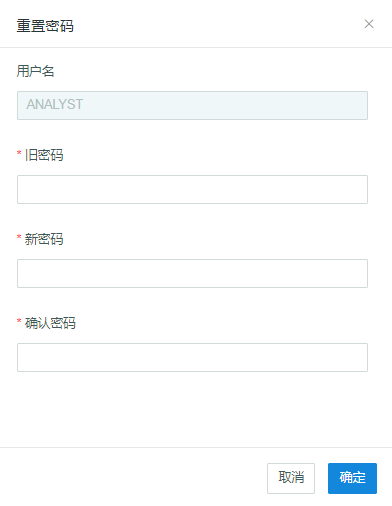
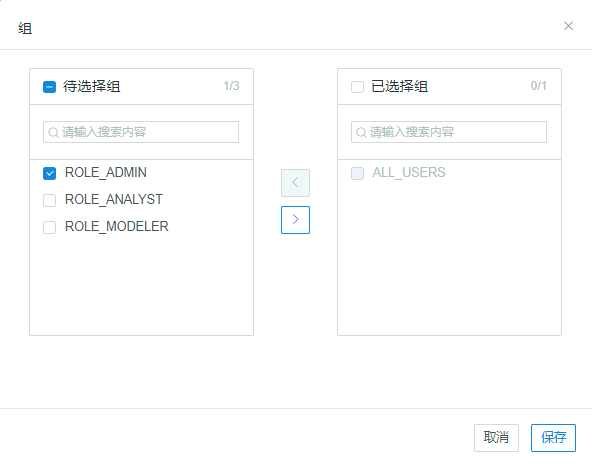
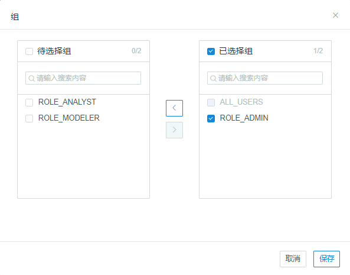

## 管理用户

本章将介绍什么是用户以及如何管理用户。

### 关于用户

所有使用 Kyligence Enterprise 的用户都需要使用账号和对应密码登录。Kyligence Enterprise 实例中的每个用户是唯一的，即不需要在同一实例的不同项目上反复创建同一个用户。
Kyligence Enterprise 默认会初始化三个用户，分别为 `ADMIN`，`MODELER` 和 `ANALYST`。其中用户 `ADMIN` 是内置的系统管理员，系统管理员拥有整个系统的所有权限。

### 管理用户

系统管理员登录 Kyligence Enterprise 后，点击导航栏的 **系统** 按钮，进入系统管理页面，点击 **用户** 栏进入用户管理页面。

**注意：**

1. 除系统管理员以外，其他用户需要在项目级别被赋予访问权限才能使用项目上的功能。
2. 除系统管理员以外，仅仅创建用户并不能让用户获得任何项目上的访问权限。

### 添加用户

在用户管理页面，系统管理员可以点击 **+用户 **按钮来增加新用户。在弹出窗口中，输入用户名，密码，确认密码，选择用户角色是系统管理员还是普通用户，点击 **确定**。



### 编辑用户

在用户管理页面，点击 **操作 **--> **...** --> **编辑用户**。

在弹出窗口中，系统管理员可以选择修改用户角色。



### 删除用户

在用户管理页面，点击 **操作 **--> **...** --> **删除**。

系统管理员可以弹出窗口中确认删除用户，用户被删除后将不能恢复，删除用户将删除用户在所有项目上的访问权限，包括项目级、表级、行级、列级等权限。

### 启用/禁用用户

在用户管理页面，点击 **操作 **--> **...** --> **启用 / 禁用**。

系统管理员可以启用或禁用用户，用户被禁用后将不可再登录系统。


### ADMIN 用户重置密码

在用户管理页面，点击 **操作 **--> **...** --> **重置密码**。

在弹出窗口中，系统管理员可以更改密码，需重复输入两次新密码。



初始的 ADMIN 账户密码在首次登陆后，需要被修改。如需恢复初始密码，可以执行如下命令：

```
$KYLIN_HOME/bin/kylin.sh admin-password-reset
```

执行成功后， ADMIN 账户密码将恢复为初始密码，其他账户密码将保持不变。

### 普通用户重置密码

点击界面右上方的 **用户名** --> **设置**。

在弹出窗口中，用户可以重置密码，需要提供旧密码并重复输入两次新密码。



### 对用户分组

如果要将某个用户分配到特定组，执行以下操作：

1. 在用户管理页面，选择要进行分组的用户。
2. 点击右侧 **操作 **--> **...** --> **分组**。
3. 在 **待选择组** 中勾选需要将用户分配到的组，点击 **向右箭头（ > ）** ，该组将进入 **已选择组**。
4. 点击 **保存**，用户将进入选定的组中。




### 修改用户所在的组

如果要修改用户所在的组，执行以下操作：

1. 在用户管理页面，选择要修改分组的用户。
2. 点击右侧 **操作 **--> **...** --> **分组**。
3. 在 **已选择组** 中勾选需要将用户分配到的组，点击 **向⬅左箭头（ < ）** ，该组将进入 **待选择组**。
4. 点击 **保存**，用户将从选定的组中移出。




### 启用 LDAP 后的用户管理

在启用 LDAP 后，用户为只读，不可添加、编辑、删除、修改用户或对用户分组。

有关 LDAP 的更多信息，参见本章 [与 LDAP 集成](ldap.cn.md)。

