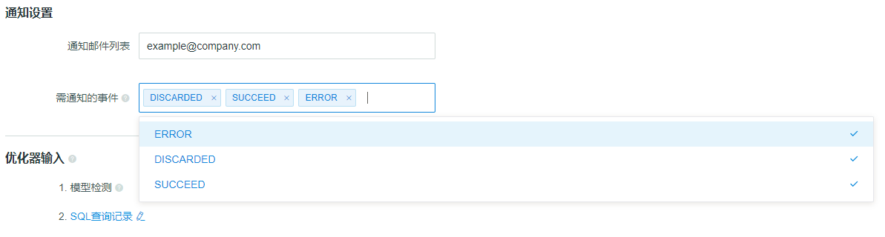

## 任务报警
Kyligence Enterprise 提供了**邮件通知**的功能，可以在Cube状态发生改变时，当Cube构建任务完成或者失败时，向Cube管理员发送电子邮件，便于运维人员进行下一步的故障排查或者增量构建。

###如何通过电子邮件实现任务报警
#### 1.在配置文件 `$KYLIN_HOME/conf/kylin.properties` 中进行如下设置：
<pre>
kylin.job.notification-enabled=true|false  # 设置为true将开启邮件通知功能
kylin.job.notification-mail-enable-starttls=true|false    
kylin.job.notification-mail-host=your-smtp-server  # 设置该项为邮件的SMTP服务器地址
kylin.job.notification-mail-port=your-smtp-port
kylin.job.notification-mail-username=your-smtp-account  # 设置该项为邮件的SMTP登录用户名
kylin.job.notification-mail-password=your-smtp-pwd  # 设置该项为邮件的SMTP登录密码
kylin.job.notification-mail-sender=your-sender-address  # 设置该项为邮件的发送邮箱地址
kylin.job.notification-admin-emails=adminstrator-address  </pre>

设置完毕后，**重新启动Kyligence Enterprise** 使配置生效。

#### 2.在Cube设计页面进行如下设置：
建模人员和分析师需要在Cube设计器页面的 `Cube 信息页`中，将自己的电子邮箱地址填入至`通知邮件列表`，如下图所示：

需要更详细的通知事件过滤，可以在`需通知的事件`中进行设置，即当 Cube 构建任务切换到这些状态时，就给用户发送邮件通知。