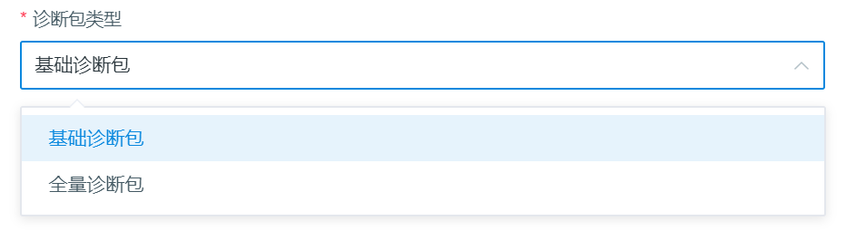
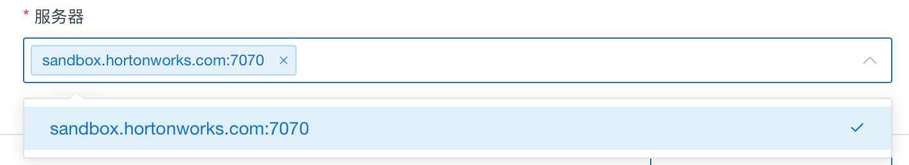
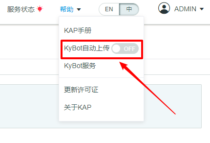
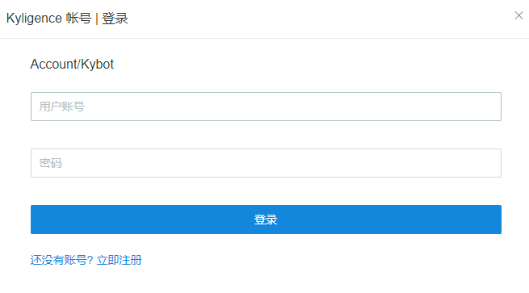
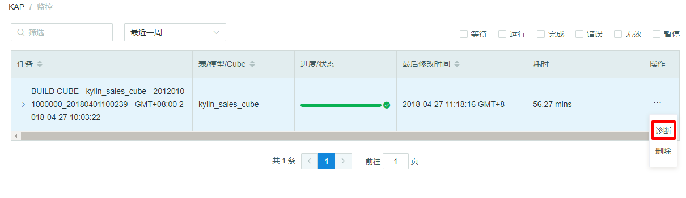

## 系统诊断与任务诊断
用户在使用 Kyligence Enterprise 过程中遇到的问题，例如 Cube 创建失败、SQL 查询失败、SQL 查询时间过长等；Kyligence Enterprise 的 Web UI 提供了一个“诊断”功能，可以将有关的信息打包成压缩包，供运维人员分析问题原因。
该功能的入口总共有两处：系统诊断和任务诊断。

### 系统诊断
系统诊断包包含整个 Kyligence Enterprise 实例的诊断信息，生成系统诊断包需要如下操作：

1. 单击`系统`页面下的`诊断`按钮

2. 选择时间范围

   可以选择`最近一小时`、`最近一天`、`最近三天`、`最近一个月`，或者自定义时间范围

   > - 注意：选择的时间范围必须包含 **Kyligence Enterprise 发生问题**的时间段。

   

3. 选择诊断包

   可以选择`基础诊断包`和`全量诊断包`

   > 选择基础诊断包将主要包含您的日志文件，元数据信息及您的环境信息。 全量诊断包将额外包括慢查询或者错误查询信息等。 一般情况下，我们推荐您选择**基础诊断包**即可 。 

   

4. 选择服务器

   > - 注意： 如果 Kyligence Enterprise 部署在多节点上，需要确定发生问题的节点，并在生成系统诊断包时选择正确的服务器名字，否则有可能系统诊断包中不包含问题的有关信息。

   

   

5. 选择将系统诊断包下载到本地或者上传到 KyBot

   > Kyligence Enterprise 提供了两种选择，可以下载到本地供运维人员分析，也可以上传到 KyBot 网站，进行自助诊断。

   点击`下载诊断包`，可以将诊断包下载至本地。

   点击`生成诊断包`并上传到 KyBot，可以将诊断包上传至 KyBot 网站。
   更多关于Kybot的使用，请参考：[自助式诊断与优化服务 KyBot](../kybot/README.md)

   同时 Kyligence Enterprise 也支持了自动上传系统诊断包的功能。
   可以通过打开`帮助`下的 `KyBot 自动上传开关`，登录 KyAccount 账号即可。

   

   

### 任务诊断
任务诊断包包含某个任务的诊断信息，生成任务诊断包需要如下操作：
1. 单击`监控`页面中某个任务，点击`操作`，展开后点击`诊断`按钮

2. 选择服务器

   

3. 选择将系统诊断包下载到本地或者上传到 KyBot

-  点击`下载诊断包`，可以将诊断包下载至本地。

-  点击`生成诊断包`，并上传到 KyBot，可以将诊断包上传至 KyBot 网站。
