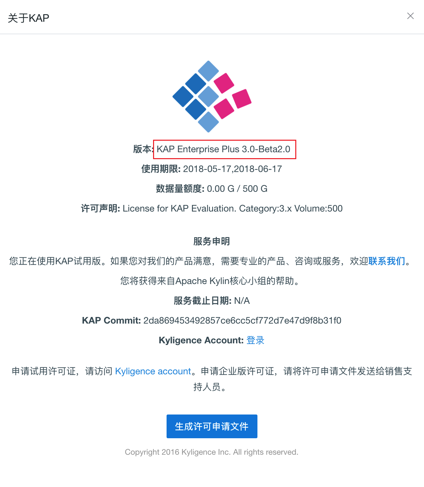
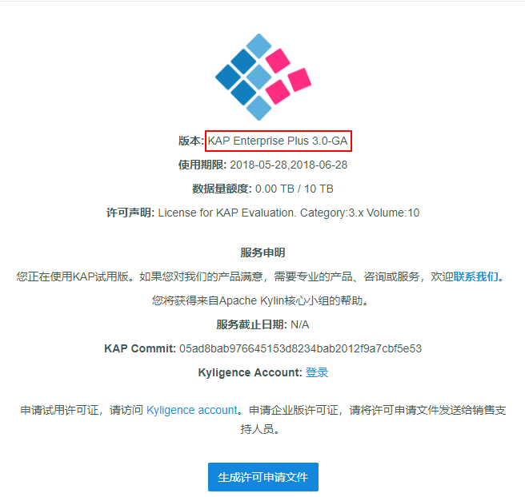

## 补丁包修复

从Kyligence Enterprise 3.X版本开始，提供了补丁包修复方式。当您需要修复当前版本时，可以通过Kybot工单系统联系Kyligence Support获取相应的版本信息，售后团队会将您需要的补丁包发送给您，之后通过补丁安装工具即可完成升级。

1. 设置环境变量`KYLIN_HOME`为当前版本的Kyligence Enterprise，并停止正在运行的Kyligence Enterprise：

   ```
   export KYLIN_HOME=/usr/local/kap-{version}
   $KYLIN_HOME/bin/kylin.sh stop
   ```

   

2. 安装补丁包修复。系统将会先全量备份旧版本软件包，再进行安装：

   ```
   sh patch.sh apply PATCH_PACKAGE
   ```
   > 注：升级时，系统将根据补丁包信息，增加、删除、替换旧版软件包相关内容，但是对于部分文件系统不进行处理。
   >
   > - `$KYLIN_HOME/logs`和`$KYLIN_HOME/tomcat/logs`不参与备份过程。如果需要备份，您可以手动单独进行备份。
   > - 升级过程不会对`$KYLIN_HOME/conf`，`$KYLIN_HOME/tomcat/conf`，`$KYLIN_HOME/ext`，`$KYLIN_HOME/meta_backups`这四个文件夹进行处理。

3. 重新启动 Kyligence Enterprise，安装成功。

   

   > 注：当安装失败的时候，您可以先对版本进行回滚。
   >
   > 在安装补丁包的时候，系统已经进行了旧版本的全量备份，备份文件与旧版本文件夹位于同一目录下，该目录也可以在安装补丁包后运行结果的第一步中看到。删除旧版本文件夹后解压缩备份文件即可完成回滚。备份文件按照`{original verison}-backup.tar.gz`的格式命名。
   >
   > 若仍存在问题，请联系Kyligence Support，售后团队将为您提供解决方案。​

